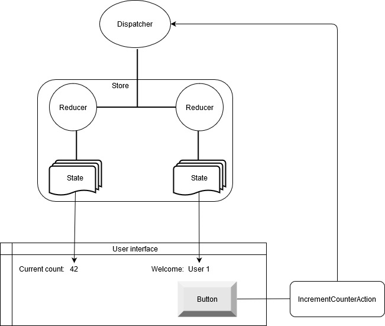

# Fluxor - documentation

## Basic concepts

### Flux pattern

Often confused with Redux. Redux is the name of a library, Flux is the name of the pattern that Redux and
Fluxor implement.

* State should always be read-only.
* To alter state our app should dispatch an action.
* The store runs the action through every registered reducer.
* Every reducer that processes the dispatched action type will create new state
from the existing state, along with any changes intended by the dispatched action.
* The UI then uses the new state to render its display.

## Samples
### Basic concepts
* TODO

### Blazor for web

* [State, actions, and reducers](../Samples/02-Blazor/02A-StateActionsReducersSample/README.md)
* [Effects](../Samples/02-Blazor/02B-EffectsSample/README.md)
* [TODO - Custom middleware](../Samples/02-Blazor/02C-MiddlewareSample/README.md)
* [TODO - Redux Dev Tools](../Samples/02-Blazor/02D-ReduxDevToolsSample/README.md)
