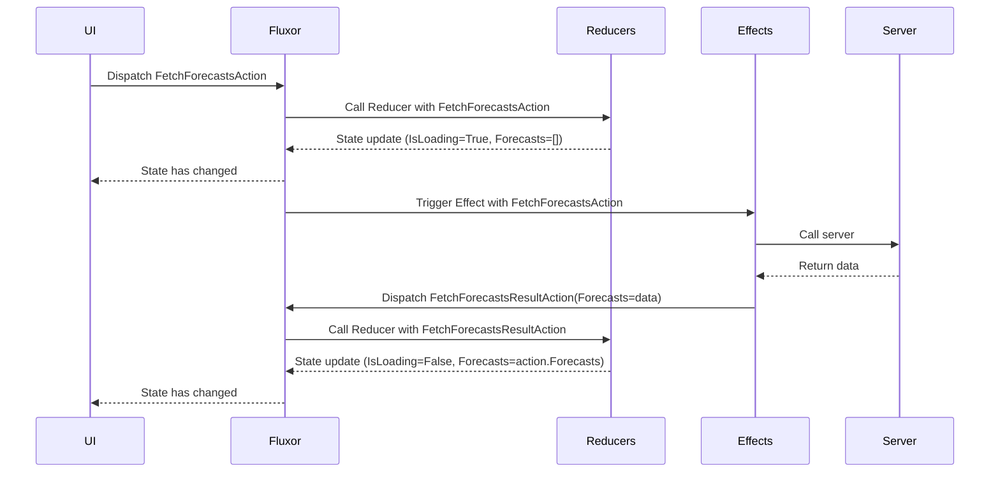

# Fluxor - Blazor Web Tutorials

## Effects

Flux state is supposed to be immutable, and that state replaced only by
[pure functions](https://en.wikipedia.org/wiki/Pure_function), which should only take input from their
parameters.

With this in mind, we need something that will enable us to access other sources of data such as
web services, and then reduce the results into our state.

This is achieved with `Effects` - see the [Mermaid diagram](#mermaid-diagram) below.

### Goal
This tutorial will expand on the previous tutorial to recreate the `Fetch data` page in a standard Blazor app.

### Steps

- Under the `Store` folder, create a new folder named `WeatherFeature`.
- Delete the source code for the `WeatherForecast` class from the bottom of `Weather.razor`
- Create a `WeatherForecast.cs` file in the `WeatherFeature` folder with the following content.

```c#
// WeatherForecast - changed to a readonly record
public record WeatherForecast(DateOnly Date, int TemperatureC, string Summary)
{
  public int TemperatureF => 32 + (int)(TemperatureC / 0.5556);
}
```

- Create a new state class to hold the state for this use case.

```c#
[FeatureState]
public record WeatherState(
  bool IsLoading,
  ImmutableList<WeatherForecast> Forecasts)
{
  public WeatherState() : this(
    IsLoading: false,
    Forecasts: [])
  {
  }
}
```

This state holds a property indicating whether or not the data is currently being retrieved from
the server, and an immutable list holding zero to many `WeatherForecast` objects.

#### Displaying state in the component

- Open the file `Weather.razor`
- Make the page descend from `FluxorComponent`.

```
@inherits Fluxor.Blazor.Web.Components.FluxorComponent
```

- Next we need to inject the `WeatherState` into our component

```razor
@using {Namespace for your WeatherFeature}
@inject IState<WeatherState> WeatherState
```


- Change the mark-up so it uses our `IsLoading` state to determine if data is being
retrieved from the server or not.

Change

```razor
@if (forecasts == null)
```

to

```razor
@if (WeatherState.Value.IsLoading)
```

- Change the mark-up so it uses our `Forecasts` state.

Change

```razor
@foreach (var forecast in forecasts)
```

to

```razor
@foreach (var forecast in WeatherState.Value.Forecasts)
```

#### Using an Action and a Reducer to initiate the fetch and UI update

- In the `WeatherFeature` folder, create a class `FetchForecastsAction` (it can remain an empty class).
- Next, create a static `Reducers` class, which will set
  `IsLoading` to true when our `FetchForecastsAction` action is dispatched.

```c#
public static class Reducers
{
  [ReducerMethod]
  public static WeatherState ReduceFetchForecastsAction(WeatherState state, FetchForecastsAction action) =>
    new WeatherState(IsLoading: true, Forecasts: []);
}
```

Alternatively, because we aren't using any values from the `FetchForecastsAction action` we
can declare our reducer method without that parameter, like so:

```c#
public static class Reducers
{
  [ReducerMethod]
  public static WeatherState ReduceFetchForecastsAction(WeatherState state) =>
    new WeatherState(IsLoading: true, Forecasts: []);
}
```

- In `Weather.razor` inject `IDispatcher` and dispatch our action from the `OnInitialized`
lifecycle method. 

```razor
@page "/weather"
@inherits Fluxor.Blazor.Web.Components.FluxorComponent
@using Store.WeatherFeature
@inject IDispatcher Dispatcher
@inject IState<WeatherState> WeatherState

... omitted ...

@code {
    protected override void OnInitialized()
    {
        base.OnInitialized();
        var action = new FetchForecastsAction();
        Dispatcher.Dispatch(action);
    }
}
```

#### Requesting data from the server via an `Effect`

Effect handlers cannot (and should not) affect state directly. They are triggered when the action
they are interested in is dispatched through the store, and as a response they can dispatch new actions.

Here is an example of how to simulate fetching forecasts. Add it into an `Effects.cs` file
inside the `WeatherFeature` folder.

```c#
public class Effects
{
  private readonly static string[] Summaries =
    ["Freezing", "Bracing", "Chilly", "Cool", "Mild", "Warm", "Balmy", "Hot", "Sweltering", "Scorching"];

  [EffectMethod(typeof(FetchForecastsAction))]
  public async Task HandleFetchForecastsAction(IDispatcher dispatcher)
  {
    // Simulate a delay
    await Task.Delay(1_000);

    DateOnly startDate = DateOnly.FromDateTime(DateTime.Now);
    var forecasts =
      Enumerable.Range(1, 5)
      .Select(
        index => new WeatherForecast(
          Date: startDate.AddDays(index),
          TemperatureC: Random.Shared.Next(-20, 55),
          Summary: Summaries[Random.Shared.Next(Summaries.Length)]
        )
      );

    var action = new FetchForecastsResultAction(forecasts);
    dispatcher.Dispatch(action);
  }
}
```

Effect handlers can be written in one of three ways.

1. By decorating instance or static methods with `[EffectMethod]`
   (the name of the class and the method are unimportant);

```c#
  [EffectMethod]
  public async Task HandleFetchForecastsAction(FetchForecastsAction action, IDispatcher dispatcher)
  {
    // code here
  }
}
```

2. As with `[ReducerMethod]`, it is possible to use `[EffectMethod]` without
  the action parameter being needed in the method signature.

```c#
  [EffectMethod(typeof(FetchForecastsAction))]
  public async Task HandleFetchForecastsAction(IDispatcher dispatcher)
  {
    // code here
  }
```

3. By descending from the `Effect<TAction>` class (not recommended).

These approaches work equally well, which you choose is an organisational choice. 

[Read notes on Static vs Instance Effects](#static-vs-instance-effects)

#### Reducing the `Effect` result into state

- Next to the `FetchForecastsAction` file, create a new class `FetchForecastsResultAction`,
  which will hold the results of the call to the server so they can be "reduced"
  into our application state.

```c#
public record FetchForecastsResultAction(IEnumerable<WeatherForecast> Forecasts);
```

This is the action that is dispatched by our `Effect` earlier, after it has retrieved the data from
the server via an HTTP request. we now need to reduce this data into state.

- Edit the `Reducers.cs` class and add a new `[ReducerMethod]` to reduce the contents of this result
action into state.

```c#
[ReducerMethod]
public static WeatherState ReduceFetchForecastsResultAction(WeatherState state, FetchForecastsResultAction action) =>
  new WeatherState(
    IsLoading: false,
    Forecasts: action.Forecasts?.ToImmutableList() ?? []);
```

This reducer simply sets the `IsLoading` state back to false, and sets the `Forecasts` state to the
values in the action that was dispatched by our effect. The Forecasts in the action are `IEnumerable<T>` so
we convert them to `ImmutableList<T>` using `ToImmutableList()`; if null then we default to an emtpy `[]`.

<a id="mermaid-diagram"></a>
## Mermaid diagram



<a id="static-vs-instance-effects"></a>
## Static vs Instance Effects
An `[EffectMethod]` can be declared either as static or instance.

If declared static then the effect cannot have any dependencies injected.

If declared as non-static within a non-static class then
1. A single instance of the owning class will be created for the store.
2. Instance methods' dependencies will be injected.
3. Multiple `[EffectMethod]`s can share property values (i.e. a CancellationToken) via the
   state of the class owning the method.

***Important: Effects instances are created once per store instance and share a lifetime with the store.***

This means that service instances injected into effects also share a lifetime with the store
which, for long-lived scopes, means they will live for the life of the user's session.
For example, Blazor apps keep one long-lived injection scope per browser window.

When injecting `HttpClient` and you anticipate a possible DNS change you could consider
instead using `IHttpClientFactory` and requesting a `HttpClient` per execution of
the effect code.
