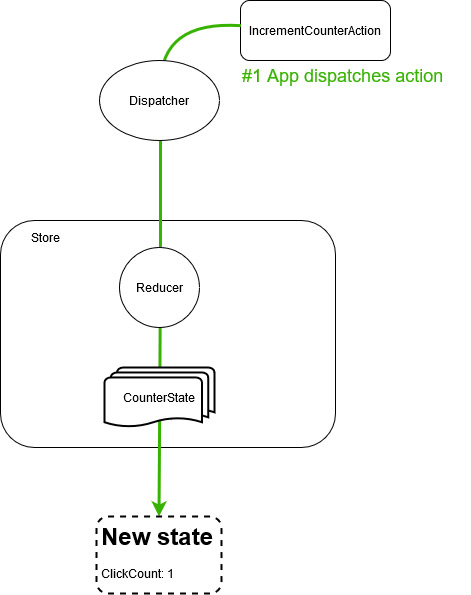

# Fluxor - Basic concepts

## State, Actions, and Reducers

### Goal
This tutorial will demonstrate how to create state, an action, and a reducer that will create a new
state based on the action dispatched.

### Steps
To do this we will create a console application, as this will avoid as much UI specific code as possible.

- Create a new console application.
- Add a NuGet package reference to `Fluxor`.
- Edit `Program.cs`. We are going to enable dependency injection and Fluxor.

```c#
class Program
{
  static void Main(string[] args)
  {
    var services = new ServiceCollection();
    services.AddScoped<App>();
    services.AddFluxor(o => o
      .ScanAssemblies(typeof(Program).Assembly));

    IServiceProvider serviceProvider = services.BuildServiceProvider();

    var app = serviceProvider.GetRequiredService<App>();
    app.Run();
  }
}
```

The `services.AddFluxor` line of code adds all Fluxor dependencies, and scans the specified assembly
for any `Fluxor` related code (states, reducers, etc).

At the moment this will not compile, because we are missing the `App` class. This class only exists as
an example of a UI element that has dependencies injected. For now, we can just create a skeleton class.

```c#
public class App
{
  public void Run()
  {
  }
}
```

#### Initialise the store
- Edit `App.cs`. Inject `IStore`, and initialise it.

```c#
using Fluxor;

public class App
{
  private readonly IStore Store;

  public App(IStore store)
  {
    Store = store;
  }

  public void Run()
  {
    Console.Clear();
    Console.WriteLine("Initializing store");
    Store.InitializeAsync().Wait();
  }
}
```

#### Adding state to the store

- Create a folder named `Store`.
- Within that folder create another folder named `CounterUseCase`.
- Within the `CounterUseCase` folder create a new class named `CounterState`. This is the class that
  will hold the values of your state to be displayed in your application.

```c#
[FeatureState]
public class CounterState
{
  public int ClickCount { get; }

  private CounterState() {} // Required for creating initial state

  public CounterState(int clickCount)
  {
    ClickCount = clickCount;
  }
}
```

- _Notes:_
  - State should be decorated with `[FeatureState]` for automatic discovery
    when `services.AddFluxor` is called. 
  - State should be immutable.
  - A parameterless constructor is required on state for determining the initial state,
    and can be private or public.
  - The folder structure used here is only a recommendation.
  - I recommend building your store and your application around use
    cases (e.g. FindSupplier, EditSupplier, etc)
    rather than a single monolith state.


#### Displaying state in our app

- Edit App.cs
- Inject a new dependency for the state, and subscribe to the event that tells us the state has changed

```c#
using YourAppName.Store.CounterUseCase;

public class App
{
  private readonly IStore Store;
  private readonly IState<CounterState> CounterState;

  public App(IStore store, IState<CounterState> counterState)
  {
    Store = store;
    CounterState = counterState;
    CounterState.StateChanged += CounterState_StateChanged;
  }

  ...
```

- Add a method to show the contents of the state whenever it changes

```c#
private void CounterState_StateChanged(object sender, CounterState e)
{
  Console.WriteLine("");
  Console.WriteLine("==========================> CounterState");
  Console.WriteLine("ClickCount is " + CounterState.Value.ClickCount);
  Console.WriteLine("<========================== CounterState");
  Console.WriteLine("");
}
```

*Note: The current value of the state is also available in the parameter `e`, but this example shows how
to inject `IState<T>` and retrieve the value from there.*


#### Dispatching an Action to indicate our intention to change state

- In `Store\CounterUseCase` create a new class `IncrementCounterAction`. This class can remain empty.
- In `App.cs` we need to inject `IDispatcher` and then use it to dispatch an instance
of our new `IncrementCounterAction` when the user tells it to.

```c#
var action = new IncrementCounterAction();
Dispatcher.Dispatch(action);
```

The `App` class should now look like the following code:

```c#
public class App
{
  private readonly IStore Store;
  public readonly IDispatcher Dispatcher;
  public readonly IState<CounterState> CounterState;

  public App(IStore store, IDispatcher dispatcher, IState<CounterState> counterState)
  {
    Store = store;
    Dispatcher = dispatcher;
    CounterState = counterState;
    CounterState.StateChanged += CounterState_StateChanged;
  }

  private void CounterState_StateChanged(object sender, CounterState e)
  {
    Console.WriteLine("");
    Console.WriteLine("==========================> CounterState");
    Console.WriteLine("ClickCount is " + CounterState.Value.ClickCount);
    Console.WriteLine("<========================== CounterState");
    Console.WriteLine("");
  }

  public void Run()
  {
    Console.Clear();
    Console.WriteLine("Initializing store");
    Store.InitializeAsync().Wait();
    string input = "";
    do
    {
      Console.WriteLine("1: Increment counter");
      Console.WriteLine("x: Exit");
      Console.Write("> ");
      input = Console.ReadLine();

      switch(input.ToLowerInvariant())
      {
        case "1":
          var action = new IncrementCounterAction();
          Dispatcher.Dispatch(action);
          break;

        case "x":
          Console.WriteLine("Program terminated");
          return;
      }

    } while (true);
  }
}
```

#### Reacting to the Action to change state
Now our UI is dispatching our intention to increment the counter, but the state remains unchanged because
we do not handle this action. We will fix that next.

- In the `Store\CounterUseCase` folder, create a new class `Reducers`.
- Make a static class, and add the following method.

```c#
public static class Reducers
{
  [ReducerMethod]
  public static CounterState ReduceIncrementCounterAction(CounterState state, IncrementCounterAction action) =>
    new CounterState(clickCount: state.ClickCount + 1);
}
```

Running the app will now work as expected and increment the counter whenever option 1 is chosen.

#### Tips

##### Removing the `unused parameter` warning

When a reducer method is executed, it is passed the action that triggered it.
This allows the reducer to access any property values in the action that was dispatched,
for example, `new CustomerSearchAction('Bob')`.

In our simple case here, we do not need any values from `IncrementCounterAction` and
including it as a parameter might result in a `unusused parameter` warning at compile time.

We can circumvent this by including the action type in the `[ReducerMethod]` instead
of the method signature.

```c#
  [ReducerMethod(typeof(IncrementCounterAction))]
  public static CounterState ReduceIncrementCounterAction(CounterState state) =>
    new CounterState(clickCount: state.ClickCount + 1);
```

##### Splitting reducer methods across multiple classes

You may have as many reducer classes as you wish, the `Reducer` class name used in this tutorial is
not a special name or anything, you can call it whatever you wish. If the method is decorated
with `[ReducerMethod]` and has the correct signature, it will be used.

```c#
public static class SomeReducerClass
{
  [ReducerMethod]
  public static SomeState ReduceSomeAction(SomeState state, SomeAction action) => new SomeState();

  [ReducerMethod]
  public static SomeState ReduceSomeAction2(SomeState state, SomeAction2 action) => new SomeState();
}

public static class SomeOtherReducerClass
{
  [ReducerMethod]
  public static SomeState ReduceSomeAction3(SomeState state, SomeAction3 action) => new SomeState();

  [ReducerMethod]
  public static SomeState ReduceSomeAction4(SomeState state, SomeAction4 action) => new SomeState();
}
```

##### Injecting dependencies

**Tip: Do not inject dependencies into reducers!**

It is also possible to decorate __instance__ methods with `[ReducerMethod]`.
Any dependencies in the class's constructor will be injected automatically.

I strongly recommend the use of static methods. Reducers should ideally be
[pure functions](https://en.wikipedia.org/wiki/Pure_function),
if you find yourself needing to inject dependencies into a reducer then you might be
taking the wrong approach, and should instead be using an Effect (covered later).

##### The `Reducer<TState, TAction>` class

It is also possible to create a reducer per state+action combination like this...

```c#
public class IncrementCounterReducer : Reducer<CounterState, IncrementCounterAction>
{
  public override CounterState Reduce(CounterState state, IncrementCounterAction action) =>
    new CounterState(clickCount: state.ClickCount + 1);
}
```

This pattern requires a lot more code, therefore its use is not recommended.

### Output
The output of running the app should look something like the following:

```
Initializing store
1: Increment counter
x: Exit
> 1

==========================> CounterState
ClickCount is 1
<========================== CounterState

1: Increment counter
x: Exit
> 1

==========================> CounterState
ClickCount is 2
<========================== CounterState

1: Increment counter
x: Exit
>
```

