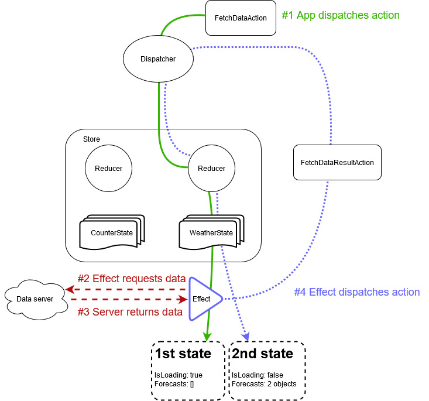

# Fluxor - Basic concepts

## Effects

Flux state is supposed to be immutable, and that state replaced only by
[pure functions](https://en.wikipedia.org/wiki/Pure_function), which should only take input from their
parameters when deciding what the output (new state) should be.

With this in mind, we need something that will enable us to access other sources of data such as
web services, and then reduce the retrieved data into our state.

### Goal
This tutorial will demonstrate how to dispatch an action to the store notifying it of our intention to
fetch data from a server, and an effect that will perform the call to the server before reducing the
result into state.

### Steps
#### Creating a mock data retrieval service

First we are going to create a simple service that will mock going to a web service and return some
data. We'll need to create the `Shared` classes (data transfer objects) and the mock `Services` that our
`Effect` can use.

- Create a folder named `Shared`. Files in here would ordinarily be in a separate project for API objects
to use when communicating with a server.
- Within that folder create a `WeatherForecast.cs` file.

```c#
public class WeatherForecast
{
	public DateTime Date { get; set; }
	public int TemperatureC { get; set; }
	public string Summary { get; set; }
	public int TemperatureF => 32 + (int)(TemperatureC / 0.5556);
}
```

- Create a folder named `Services`.
- Within that folder create a `WeatherForecastService.cs` file with the following interface
and class in it. This will emulate retrieving data from a remote server.

```c#
using YourAppName.Store.Shared;

public interface IWeatherForecastService
{
	Task<WeatherForecast[]> GetForecastAsync(DateTime startDate);
}

public class WeatherForecastService : IWeatherForecastService
{
	private static readonly string[] Summaries = new[]
	{
		"Freezing", "Bracing", "Chilly", "Cool", "Mild", "Warm", "Balmy", "Hot", "Sweltering", "Scorching"
	};

	public async Task<WeatherForecast[]> GetForecastAsync(DateTime startDate)
	{
		await Task.Delay(1000); // Simulate a 1 second response time
		var rng = new Random();
		return Enumerable.Range(1, 2).Select(index => new WeatherForecast
			{
				Date = startDate.AddDays(index),
				TemperatureC = rng.Next(-20, 55),
				Summary = Summaries[rng.Next(Summaries.Length)]
			})
			.ToArray();
	}
}
```

- Finally, register the mock service in `Program.cs`.

```c#
services.AddScoped<IWeatherForecastService, WeatherForecastService>();
```

#### Creating a state for our use-case

- Under the `Store` folder, create a new folder named `WeatherUseCase`.
- Create a new state class to hold the state for this use-case.

```c#
using YourAppName.Store.Shared;

public class WeatherState
{
	public bool IsLoading { get; }
	public IEnumerable<WeatherForecast> Forecasts { get; }

	public WeatherState(bool isLoading, IEnumerable<WeatherForecast> forecasts)
	{
		IsLoading = isLoading;
		Forecasts = forecasts ?? Array.Empty<WeatherForecast>();
	}
}
```

This state holds a property indicating whether or not the data is currently being retrieved from
the server, and an enumerable holding zero to many `WeatherForecast` objects.

*Note: Again, the state is immutable*

- Create a new class named `Feature`. This class describes the state to the store.

```c#
public class Feature : Feature<WeatherState>
{
	public override string GetName() => "Weather";
	protected override WeatherState GetInitialState() =>
		new WeatherState(
			isLoading: false,
			forecasts: null);
}
```

#### Displaying state in our app

- Inject `IState<WeatherState>` into our `App` class
```c#
public class App
{
	public class App
	{
		...
		private readonly IState<WeatherState> WeatherState;

		public App(
			...
			IState<WeatherState> weatherState)
		{
			...
			WeatherState = weatherState;
			WeatherState.StateChanged += WeatherState_StateChanged;
		}

}
```

- Add the following code to output the current `WeatherState` to the console.

```c#
private void WeatherState_StateChanged(object sender, WeatherState e)
{
	Console.WriteLine("");
	Console.WriteLine("=========================> WeatherState");
	Console.WriteLine("IsLoading: " + WeatherState.Value.IsLoading);
	if (!WeatherState.Value.Forecasts.Any())
	{
		Console.WriteLine("--- No weather forecasts");
	}
	else
	{
		Console.WriteLine("Temp C\tTemp F\tSummary");
		foreach (WeatherForecast forecast in WeatherState.Value.Forecasts)
			Console.WriteLine($"{forecast.TemperatureC}\t{forecast.TemperatureF}\t{forecast.Summary}");
	}
	Console.WriteLine("<========================== WeatherState");
	Console.WriteLine("");
}
```

*Note: As already mentioned, the current state is in the `e` parameter. As previously, this code
uses the injected state to demonstrate how to get hold of state at any point and not only when it is
updated*.


#### Using an `Action` and a `Reducer` to alter state

- In the `Store\WeatherUseCase` folder, create an empty class `FetchDataAction` (this can remain empty).
- Create a static `Reducers` class, which will set `IsLoading` to true when our 
`FetchDataAction` action is dispatched.

```c#
public static class Reducers
{
	[ReducerMethod]
	public static WeatherState ReduceFetchDataAction(WeatherState state, FetchDataAction action) =>
		new WeatherState(
			isLoading: true,
			forecasts: null);
}
```

- In our `App` class add code to dispatch the action when option 2 is chosen.


```c#
public void Run()
{
	...
	Console.WriteLine("2: Fetch data");
	...
		switch(input.ToLowerInvariant())
		{
			case "1":
				var incrementCounterActionction = new IncrementCounterAction();
				Dispatcher.Dispatch(incrementCounterActionction);
				break;

			case "2":
				var fetchDataAction = new FetchDataAction();
				Dispatcher.Dispatch(fetchDataAction);
				break;

			case "x":
				Console.WriteLine("Program terminated");
				return;
		}

	...
}
```

#### Requesting data from the server via an `Effect`

Effect handlers cannot (and should not) affect state directly. They are triggered when the action
they are interested in is dispatched through the store, and as a response they can dispatch new actions.

Effect handlers can be written in one of two ways.

1. By descending from the `Effect<TAction>` class. The name of the class is unimportant, and `TAction`
identifies the type of action that should trigger this `Effect`.

```c#
public class FetchDataActionEffect : Effect<FetchDataAction>
{
	private readonly IWeatherForecastService WeatherForecastService;

	public FetchDataActionEffect(IWeatherForecastService weatherForecastService)
	{
		WeatherForecastService = weatherForecastService;
	}

	public override async Task HandleAsync(FetchDataAction action, IDispatcher dispatcher)
	{
		var forecasts = await WeatherForecastService.GetForecastAsync(DateTime.Now);
		dispatcher.Dispatch(new FetchDataResultAction(forecasts));
	}
}
```

2. By decorating instance or static methods with `[EffectMethod]`. The name of the class and the
method are unimportant.

```c#
public class Effects
{
	private readonly IWeatherForecastService WeatherForecastService;

	public Effects(IWeatherForecastService weatherForecastService)
	{
		WeatherForecastService = weatherForecastService;
	}

	[EffectMethod]
	public async Task HandleFetchDataAction(FetchDataAction action, IDispatcher dispatcher)
	{
		var forecasts = await WeatherForecastService.GetForecastAsync(DateTime.Now);
		dispatcher.Dispatch(new FetchDataResultAction(forecasts));
	}
}
```

Both techniques work equally well, which you choose is an organisational choice. However, if your effect
requires lots of (or unique) dependencies then you should consider having the handling method in its
own class for simplicity (still either approach #1 or #2 may be used).

#### Reducing the resulting data into state

- Create a new class `FetchDataResultAction`, which will hold the results of the call to the server
so they can be "reduced" into our application state.

```c#
public class FetchDataResultAction
{
	public IEnumerable<WeatherForecast> Forecasts { get; }

	public FetchDataResultAction(IEnumerable<WeatherForecast> forecasts)
	{
		Forecasts = forecasts;
	}
}
```

This is the action that is dispatched by our `Effect` earlier, after it has retrieved the data from
our mock server.

- Edit the `Reducers.cs` class and add a new `[ReducerMethod]` to reduce the contents of this result
action into state.

```c#
[ReducerMethod]
public static WeatherState ReduceFetchDataResultAction(WeatherState state, FetchDataResultAction action) =>
	new WeatherState(
		isLoading: false,
		forecasts: action.Forecasts);
```

This reducer simply sets the `IsLoading` state back to false, and sets the `Forecasts` state to the
values in the action that was dispatched by our effect.

### Output
The output of running the app should look something like the following:

```
Initializing store
1: Increment counter
2: Fetch data
x: Exit
> 2

=========================> WeatherState
IsLoading: True
--- No weather forecasts
<========================== WeatherState

1: Increment counter
2: Fetch data
x: Exit
>
=========================> WeatherState
IsLoading: False
Temp C  Temp F  Summary
8       46      Mild
-8      18      Sweltering
<========================== WeatherState
```

1. Our `App` class dispatches the `FetchDataAction` action to notify the store of our intent.
* The `ReduceFetchDataAction` reducer method sets `IsLoading` to true, so our UI can reflect the change.
2. The effect method is triggered by the `FetchDataAction` and asynchronously makes a data request
to our mock server.
* The call to `Dispatcher.Dispatch(fetchDataAction)` in our `App` class completes, so redisplays the
menu options.
3. One second later the mock service returns data.
4. The effect method bundles the result data into a new `FetchDataResultAction` and dispatches the action.
* The `ReduceFetchDataResultAction` reducer methods sets `IsLoading` to false, and sets `Forecasts`
to the values in the action.
* The store now has new state for `WeatherState` so executes its `StateChanged` event, resulting in the
new state being output to the console below the options menu.


